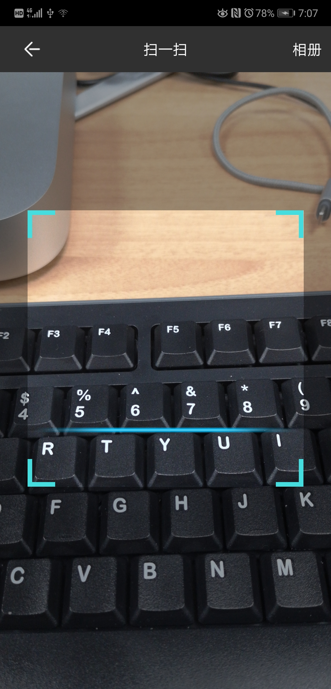
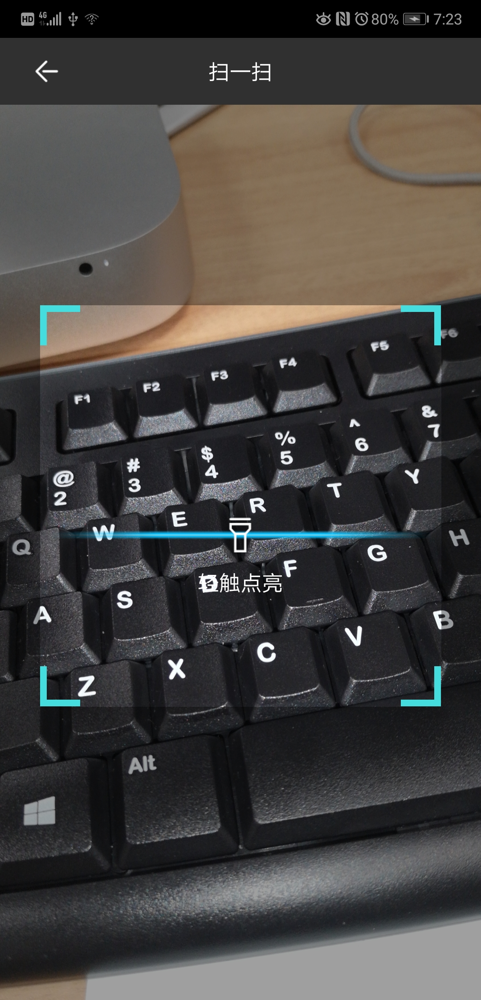

# EasyZxing
基于Zxing二次开发封装，可直接使用，封装了权限/相册等等

#使用方法

##直接调用(不需要相册选择)
```
public static void start(Activity context,int req)
```
##直接调用(需要相册选择）
```
public static void start(Activity context,int req,boolean needAlbum)
```
#界面简介，通用


#手电筒开关会在光线若的情况下自动打开


#读取相册 使用相机权限也已经封装

#参数
## req：回调结果code
## needAlbum：是否需要相册选择

## License
 Copyright 2018 Winton

Licensed under the Apache License, Version 2.0 (the "License");
you may not use this file except in compliance with the License.
You may obtain a copy of the License at

   http://www.apache.org/licenses/LICENSE-2.0

Unless required by applicable law or agreed to in writing, software
distributed under the License is distributed on an "AS IS" BASIS,
WITHOUT WARRANTIES OR CONDITIONS OF ANY KIND, either express or implied.
See the License for the specific language governing permissions and
limitations under the License.
